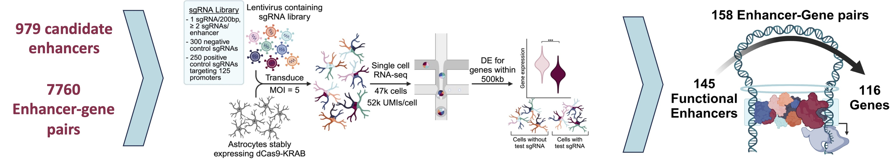

This website allows the exploration of CRISPR interference (CRISPRi) data on enhancers in normal human astrocytes (NHAs), from Green et al. 2024. 
For each enhancer-gene pair tested in the screen, the following data is available:

Statistical significance and effect size (Hit, log2FC, P, FDR), displayed in a searchable table and displayed on the corresponding Volcano plot.

search the table by gene name or hg38 genome coordinates
to download the data click on the CSV button.

ATAC-seq, TT-seq, and Deep-learning-based functional variant annotation, displayed as a UCSC genome browser track collection.

select an enhancer-gene pair in the table OR plot and click the UCSC button to navigate to the enhancer position.
